***Understanding LINUX***

**History of Linux**

In 1991, **Linus Torvalds** - a Finnish computer science student started
developing the Linux kernel as a hobby. He aimed to create a free and
open source Unix like operating system kernel.

The first public release of the Linux kernel version 0.01 occurred in
September 1991.

The **GNU** Project led by **Richard Stallman** had been developing free
software components for a complete Unix like operating system.

Linux became part of the GNU system combining the Linux kernel with GNU
utilities to create a full operating system.

The combination of the **Linux kernel** and **GNU** utilities formed the
**Linux Operating System**.

Linux played a vital role in popularizing the open source development
model. The source code for Linux is freely available, allowing anyone to
view, modify, and distribute it. This openness encouraged collaboration,
innovation, and a community driven approach to software development.

The history of Linux reflects a remarkable journey from a personal
project to a Important part of modern computing.

**Linux Distribution:***

Various groups and organizations packaged the Linux kernel with software
and utilities to create Linux distributions. For Example : **Debian**,
**Ubuntu**, **Red** **Hat**, and **Fedora**. Each distribution provides
a specific user with different package management systems, desktop
environments, and configurations.

**Linux Today:***

Linux has grown beyond its origins and is widely used in various
domains.

It powers servers, embedded systems, and supercomputers.

The Android operating system based on the Linux kernel is used in the
Mobile phones which we use.

Linux also serves as the foundation for cloud computing platforms and it
is a preferred choice for developers and system administrators.

Linux's success is rooted in its open source nature, strong
architecture, and the combined efforts of a global community.

**Basics of Linux Operating System***

The basics of Linux includes its kernel, shell, file system, users, and
permissions. These basics set the foundation for understanding and made
it easier to use this powerful operating system.

It has become widely popular due to its stability, security and
originality and creativity.

Linux is known for its multiuser and multitasking capabilities.

Key components includes:

1.  *The Kernel** (core of the operating system)

> 2\. ***Shell*** (user interface for interacting with the system) and
> various utilities and applications.

The **Shell** is a command line interpreter that allows users to
interact with the operating system by typing commands. Popular shells
include **Bash**, **Zsh**, and **Fish**. The *Command Line Interpreter
(CLI)** provides powerful tools for file manipulation,
process management, and system configuration.

**Linux File System***

Linux organizes its file system according to a **hierarchy**.

The Linux file system hierarchy is a standardized organization of
directories and files across Linux distributions. This hierarchy
provides a structured way to organize and locate files.

*Key directories in the Linux file system hierarchy:**

Each directory serves a specific purpose in the overall functioning of
the system.

1.  / (Root Directory):

The root directory is the top level directory in the file system
hierarchy.

All other directories and files are subdirectories or files within the
root directory.

The root directory is represented by a forward slash (/).

2.  /bin (Essential Binaries):

> Contains essential system binaries (executable files) needed for
> system recovery and maintenance.
>
> Common commands like ls, cp and mv are located here.

3.  /boot (Boot Loader Files):

> Contains files necessary for the system's boot process including the
> kernel, initial RAM disk and boot loader configuration.

4.  /dev (Device Files):

Contains device files that represent physical and virtual devices.

Examples : /dev/sda (first hard drive) and /dev/null (null device).

5.  /etc (Configuration Files):

> Contains system-wide configuration files and scripts.
>
> Configuration files for various software and services are stored here.

6.  /home (User Home Directories):

Contains home directories for individual users.

Each user typically has a subdirectory under /home with their username.

7.  /lib (Library Files):

> /lib contains essential shared libraries needed for system boot and
> recovery.

8.  /media and /mnt (Mount Points):

> /media and /mnt are used as mount points for external storage devices
> and network shares.
>
> External drives and mount points are often created under these
> directories.

9.  /opt (Optional Software Packages):

> Contains subdirectories where optional software packages can be
> installed.
>
> Some third-party applications install in /opt to keep their files
> organized.

10. /proc (Process Information):

> A virtual file system providing information about running processes
> and system configuration.
>
> Contains directories and files that represent processes and system
> information.

11. /root (Root User Home Directory):

> The home directory for the root user.
>
> Root's home directory is different from regular user home directories.

12\. /run (Runtime Data):

Contains runtime data such as process IDs and system state information.

Temporary files and directories related to running processes are stored
here.

12. /sbin (System Binaries):

Contains system binaries essential for system administration.

Commands in /sbin are used by the root user.

15\. /sys (Sysfs File System):

A virtual file system exposing kernel-related information and
configuration settings.

Allows interaction with the kernel and kernel modules.

16\. /tmp (Temporary Files):

A directory for temporary files that are typically deleted upon system
reboot.

Users and applications can write temporary files to /tmp.

17\. /usr (User Binaries and Data):

Contains user-related binaries, libraries, documentation, and source
code.

Often considered the read-only part of the system.

18\. /var (Variable Data):

Contains variable data that changes during normal system operation.

**File And Directory Operations:***

*Basic Commands For Navigating The File System.**

1.  pwd -- print the current working directory.

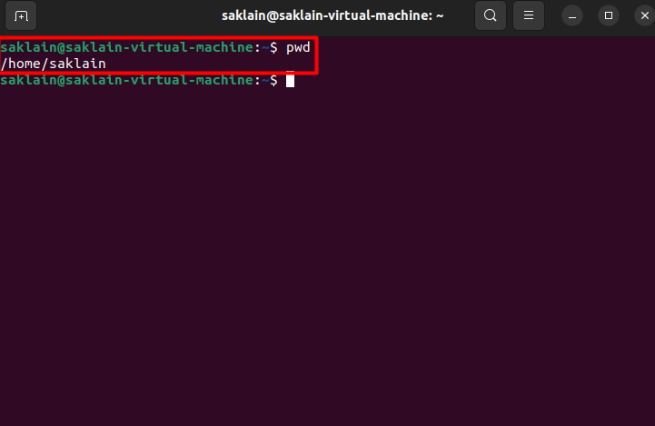

2.  ls -- List the files and directories in the current directory.

-   Ls -l -- lists the files and directories in a detailed form.

-   Ls -a -- lists the files and directories along with the hidden
    files.

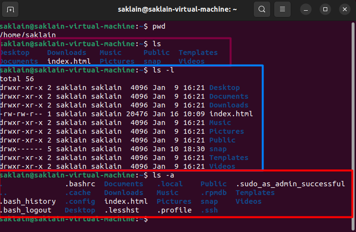

3.  cd -- change the current directory.

cd ../ - This command is used to go a folder or directory back from the
current directory.

> 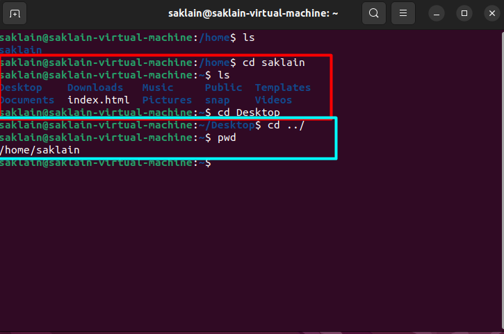
>
> **Understand File and Directory Permissions.***

In Linux, the **'chmod'** and **'chown'** commands are used to modify
files, directory permissions and ownership. These commands are essential
for managing access control and ownership of files and directories in a
Unix like operating system.

*chmod Command:**

The chmod command is used to change the permissions of a file or
directory. It allows you to control who can read, write, or execute a
file.

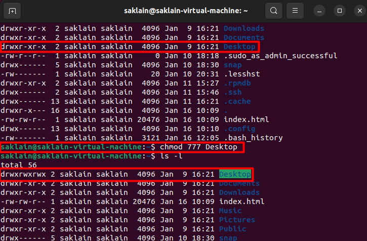

*Numeric Notation in chmod:**

The numeric notation represents permission bits: read (4), write (2) and
execute (1). The sum of these values represents the permission.

-   For example, 'chmod 755 file.txt' sets read, write, and execute
    permissions for the owner, and read and execute permissions for the
    group and others.

```{=html}
<!-- -->
```
-   The first digit represents the owner of the file/directory.

-   The second digit represents the group that the file/directory
    belongs to.

```{=html}
<!-- -->
```
-   The third digit represents all other users.

-   0 (no permission)

-   1 (execute only)

-   2 (write only)

-   3 (write and execute)

-   4 (read only)

-   5 (read and execute)

-   6 (read and write)

-   7 (read, write, and execute)

*chown Command:**

The chown command is used to change the ownership of a file or
directory. It allows you to change the user and group ownership.


**Basic Commands***

*Command Line Interface (CLI):**

Basic Command Line Interface (CLI) commands in Linux are essential for
interacting with the operating system.

1.  ls -- List the files and directories in the current directory.

-   Ls -l -- lists the files and directories in a detailed form.

-   Ls -al -- lists the files and directories along with the hidden
    files.

> 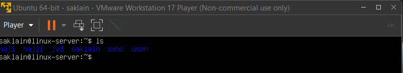
>
> 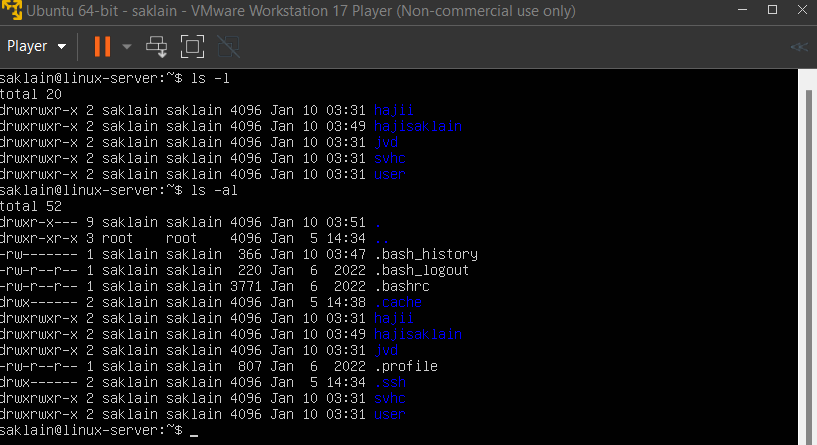

2.  cd -- change the current directory.

> 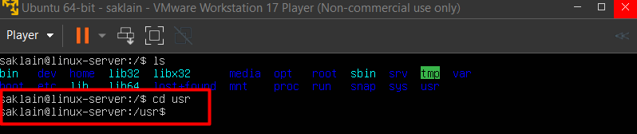

3.  cd ../ - This command is used to go a folder or directory back from
    the current directory.

> 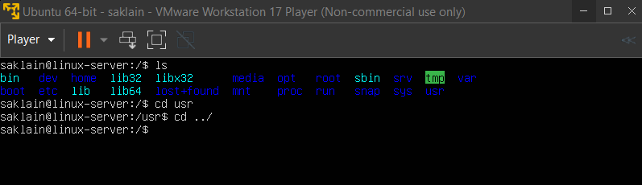

4.  mkdir - create a new directory.

> 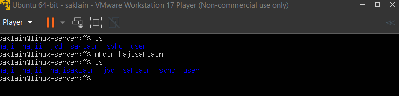

5.  rmdir -- remove a directory.

> 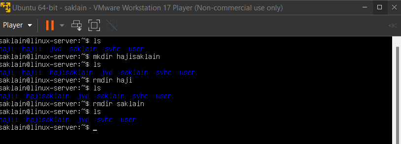

6.  touch -- create a file.

> 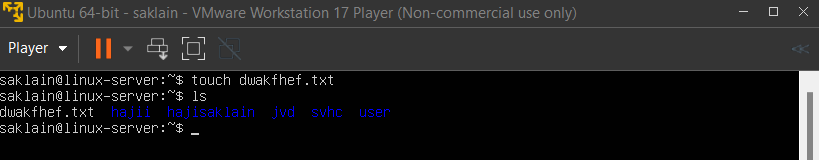

7.  rm -- remove/delete any file.

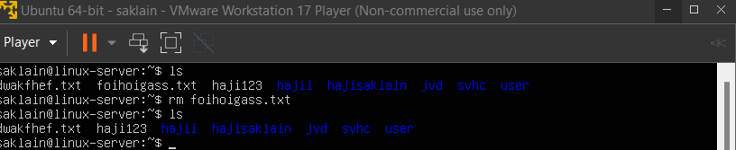

*File Manipulation:**

1.  vim -- vim command is used to edit or insert in your files.

> 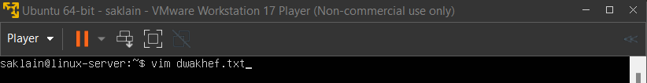
>
> Press i to insert into your files.
>
> 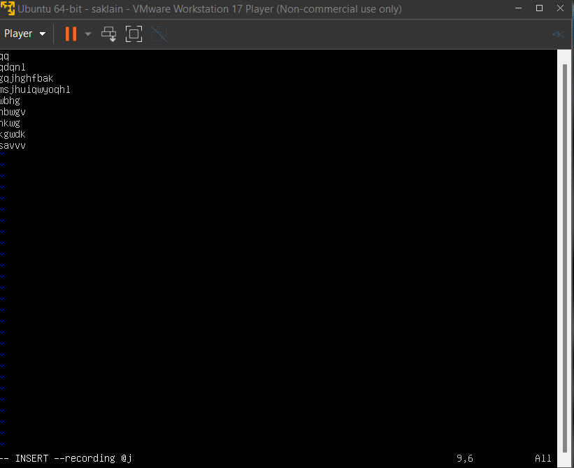

After you finish inserting pres esc then enter :wq to save and exit, :q
to quit, :q! to to force quit without save.

2.  Nano -- It is similar to vim command but it is much easier to use or
    edit the data in any file. It removes the complexity by adding
    simple methods to edit any file.

If nano is not installed, the install it using : sudo apt install nano.

> 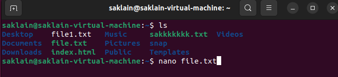
>
> After Executing the command, the below screen will appear.
>
> 
>
> You can easily edit the data inside the files just by navigating using
> the arrow keys and taking the help of the shortcuts given below.

Ctrl + G: To get help with nano commands.

Ctrl + O: Save changes to the file (Write Out).

Ctrl + W: Search for text forward.

Ctrl + K: Cut (delete) from the cursor position to the end of the line.

Ctrl + T : Will allow you to browse the file system and look for a file
to open.

Ctrl + R: To insert the contents of an existing file at the cursor
location.

Ctrl + U : Paste contents of the cut buffer.

*Users and Permissions**

-   *User Management:** User management in Linux involves
    creating, modifying, and deleting user accounts, as well as managing
    group memberships and setting up appropriate permissions.

1.  **Creating Users:**

-   **useradd**: Used to create a new user account.

-   **passwd**: Used to set a password for the newly created user.

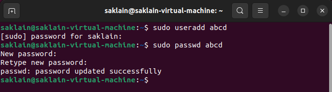

2.  **Modifying User Properties**:

**usermod**: Allows you to modify user account properties, such as
username, home directory, or group membership.

-   sudo usermod -l newusername oldusername - is used to change username

-   sudo usermod -d /new/home/directory username -- is used to change
    home directory

-   sudo usermod -g newgroup username - is used to change primary group

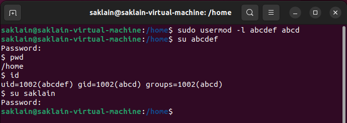

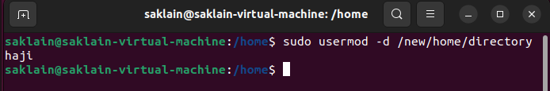

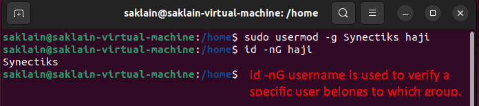

3.  **Deleting Users:**

**userdel**: Deletes a user account.

-   sudo userdel username -- deletes a user account

-   sudo userdel -r username : Removes the user\'s home directory along
    with the user account.

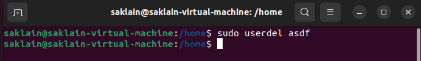

4.  **Viewing User Information:**

-   **id**: Displays user and group information.

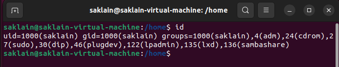

-   **finger**: Displays detailed user information.

> 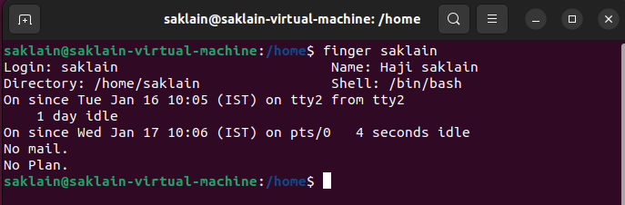

5.  **Checking Last Login:**

-   **last**: Shows a list of last logged in users.

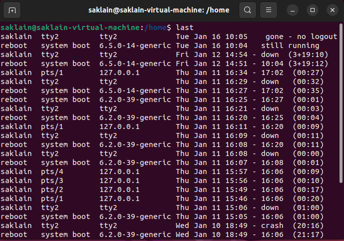

-   *File Permissions:**

File permissions dictate how users and processes can interact with files
and directories. Each file and directory has permissions that determine
who can read, write, or execute them. Understanding and managing file
permissions is important for the security and proper functioning of a
Linux system. It ensures that users have appropriate access to files and
directories while preventing unauthorized access. Regularly reviewing
and updating file permissions is good practice for system
administration.

Permissions are assigned to three categories of users: owner, group and
others.

1.  **Permission Types**:

Read (r): Allows the user to read the contents of the file or view the
contents of a directory.

Write (w): Allows the user to modify the file or create, delete, or
rename files within a directory.

Execute (x): Allows the user to execute the file as a program or travel
into a directory.

2.  **Symbolic Representation:**

Permissions are represented using a symbolic notation with three sets of
characters. Each character represents the owner, group, and others. The
order is typically \`rwx\` for each set.

For example: 'rw-r\--r\--\' represents read and write permissions for
the owner, and read-only permissions for the group and others.

3.  **Numeric Representation:**

Permissions can also be represented using a numeric notation, where each
permission has a corresponding numeric value:

-   Read (r) = 4

-   Write (w) = 2

-   Execute (x) = 1

The total permission value for a user is the sum of these values.

For example : 'rw-r\--r---' would be represented as 644 in numeric
notation.

4.  **Commands to Manage Permissions:**

-   **chmod**: Used to change the permissions of a file or directory.


5.  **Viewing Permissions:**

ls: Used with the \`-l\` option to display detailed information,
including permissions, for files and directories.

-   ls -l

> 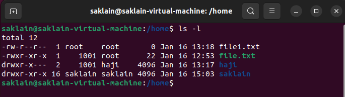

6.  **Changing Ownership:**

-   **chown**: Used to change the owner of a file or directory.


*Package Management**

*Package Managers:**

Package managers are tools that simplify the installation, removal, and
management of software packages on a system. Different Linux
distributions have their own package management systems.

Here are some commonly used package managers:

1.  *Advanced Package Tool (APT):**

> **Distributions**: Debian, Ubuntu, and derivatives.
>
> **Commands**:

**apt-get**: Used for handling packages.

**apt-cache** : Used to search for packages and display package
information.

-   sudo apt-get update - Update package lists.

-   sudo apt-get install package_name - Install a package.

-   sudo apt-get remove package_name - Remove a package.

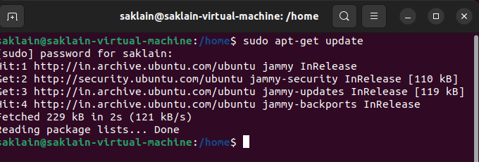

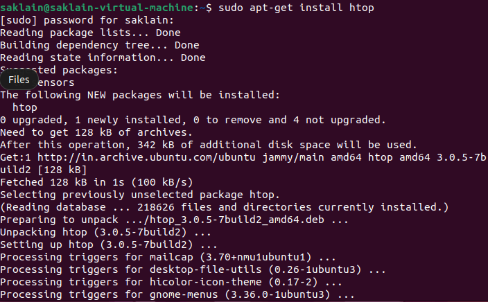

2.  *Yum (Yellowdog Updater, Modified):**

> **Distributions**: Red Hat Enterprise Linux (RHEL), CentOS, Fedora.
>
> **Commands**: yum - Used for installing, updating, and removing
> packages.

-   sudo yum install package_name - Install a package.

-   sudo yum remove package_name - Remove a package.

3.  *zypper:**

> **Distributions**: openSUSE, SUSE Linux Enterprise.

**Commands:**

-   sudo zypper install package_name - Install a package.

4.  *dnf (Dandified YUM):**

**Distributions**: Fedora, RHEL 8, CentOS 8 and later.

**Commands**:

**Dnfm** is Similar to Yum and is used for package management.

-   sudo dnf install package_name - Install a package.

-   sudo dnf remove package_name - Remove a package.

5.  *Pacman:**

**Distributions**: Arch Linux and Arch based distributions.

**Commands**:

sudo pacman -S package_name - Install a package.

sudo pacman -R package_name - Remove a package.

*Process Management**

*Managing Processes:**

Process management involves monitoring, controlling, and interacting
with running processes.

Here are some commonly used commands and techniques for managing
processes:

1.  **Viewing Processes**:

-   ps: Displays deailed information about all active processes.

> 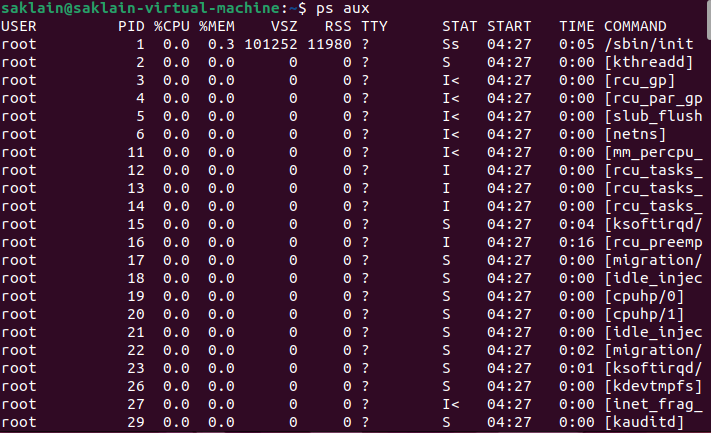

-   top: Interactive command that provides real time information about
    system resource usage and running processes.

> 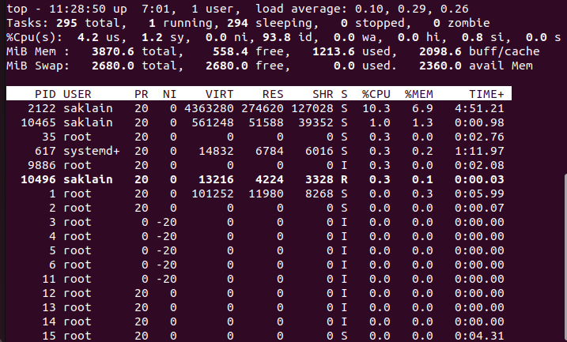

-   htop: An enhanced version of top with a more user-friendly
    interface.

> 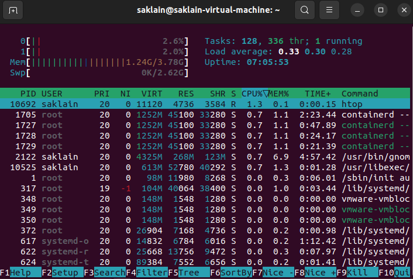

2.  **Killing Processes:**

-   kill: Sends a signal to a process, allowing you to terminate it.

-   pkill: Kills or signal processes based on their name.

-   killall: Kills processes by name.

> 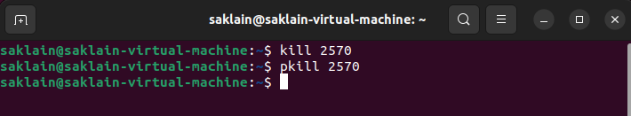

3.  **Foreground and Background Processes:**

**fg:** Brings a background process to the foreground.

**bg**: Resumes a stopped background process.

**jobs**: Lists the currently running and stopped background jobs.

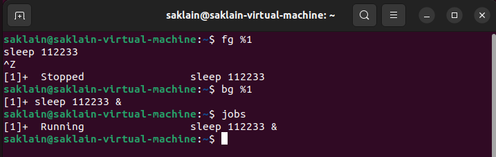

*System Administration**

*System Configuration:**

1.  **Configuration Files:**

Many system configuration settings are stored in text based
configuration files. Common directories where these files are located
include /etc and /etc/sysconfig.

Here are a few important configuration files:

/etc/hostname : Contains the system\'s hostname.

/etc/network/interfaces or
/etc/sysconfig/network-scripts/ifcfg-\<interface\> : Configures network
interfaces.

/etc/fstab : Defines how disk drives and partitions should be mounted.

/etc/resolv.conf : Specifies DNS server information.

/etc/hosts : Maps IP addresses to hostnames.

2.  **Hostname Configuration:**

-   **Using hostnamectl:** You can use hostnamectl to query and change
    the system hostname.

-   **Display current hostname:** hostnamectl

-   **Set a new hostname:** sudo hostnamectl set-hostname "new-hostname"

```{=html}
<!-- -->
```
-   **Check changes:** hostnamectl

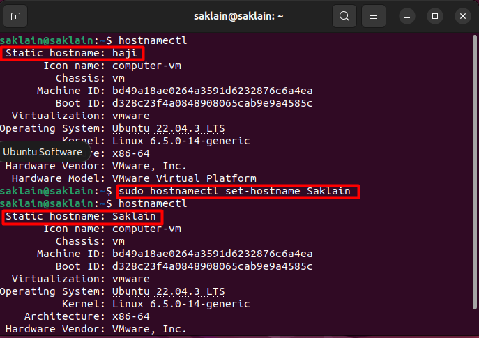

3.  **Network configuration :**

> *System Logs:**

System logs are located in the "/var/log" directory on Linux systems.
They are valuable for troubleshooting and monitoring the health of the
system. Different log files store information related to various aspects
of the system including kernel messages, system events, authentication,
application logs, and more. Here are some commonly used log files and
how to troubleshoot using them:

1.  **Syslog ('/var/log/syslog' or '/var/log/messages'):**

Syslog contains general system messages, including kernel messages and
system related events.

-   **Viewing syslog:** cat /var/log/syslog

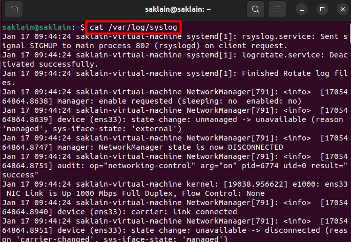

-   **Filtering for specific entries:** grep \"keyword\" /var/log/syslog

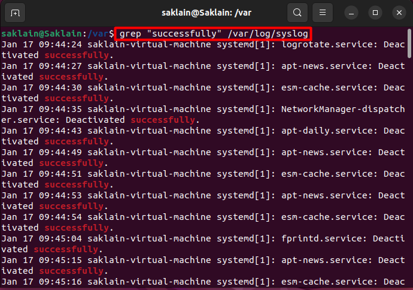

2.  **Kernel Log ('/var/log/kern.log'):**

Kernel log records messages generated by the Linux kernel.

-   **Viewing kernel log:** cat /var/log/kern.log

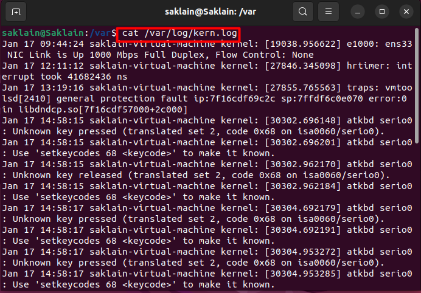

3.  **Authentication Log ('/var/log/auth.log' or '/var/log/secure'):**

Authentication log records user authentication information, including
login attempts and security-related events.

-   **Viewing authentication log:** cat /var/log/auth.log

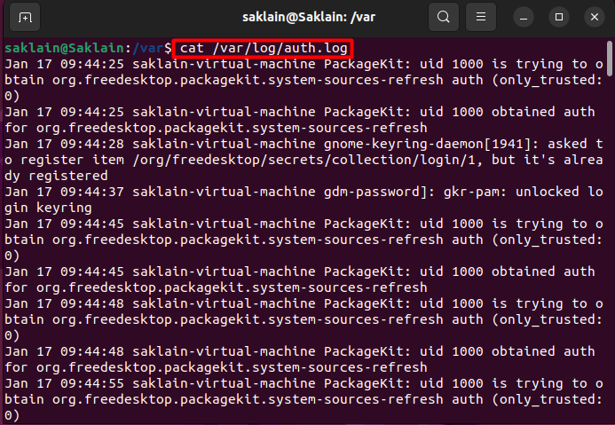

4.  **Application Logs ('/var/log/\<application_name\>'):**

Various applications and services have their own log files in the
\`/var/log\` directory.

-   **Viewing application logs :** cat /var/log/apache2/error.

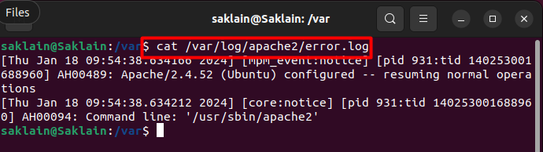

5.  **System Boot Logs ('/var/log/boot.log'):**

Boot log contains information related to the system boot process.

**Viewing boot log**: cat /var/log/boot.log

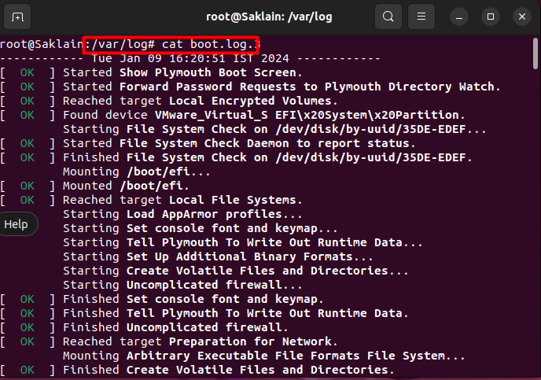

-   [Troubleshooting Steps:

```{=html}
<!-- -->
```
-   **Identify the Problem:**

Look for error messages or warnings in the logs that correspond to the
time when the issue occurred.

-   **Search for Keywords:**

Use tools like \`grep\` or \`awk\` to filter logs for specific keywords
related to the problem.

-   **Check Timestamps:**

Note the timestamps in the logs to correlate events and identify the
sequence of actions leading to the issue.

-   **Examine Related Logs:**

Check multiple logs (syslog, auth.log, application-specific logs) to get
a comprehensive view of the system state.

-   **Investigate Error Messages:**

Look for detailed error messages or stack traces that provide
information about the cause of the issue.

-   **Check Disk Space and Resource Utilization:**

Insufficient disk space or high resource utilization can lead to issues.
Check relevant logs for resource-related warnings.

-   **Consult Documentation:**

Refer to the documentation of the applications or services involved for
troubleshooting guidance.

-   Real time Log Monitoring:

1.  tail Command: tail -f /var/log/syslog

> Use tail to monitor log files in real-time.
>
> 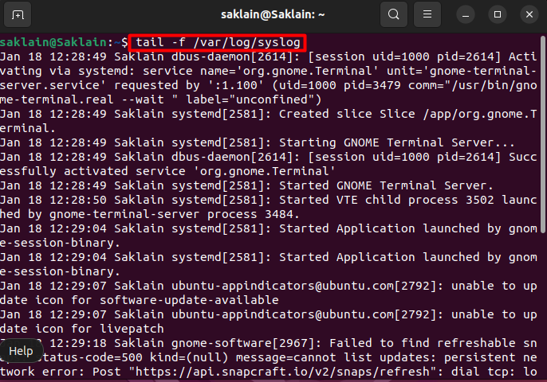

2.  journalctl Command: journalctl -xe

> For systems using ,systemd' you can use 'journalctl' to view and
> follow logs.
>
> 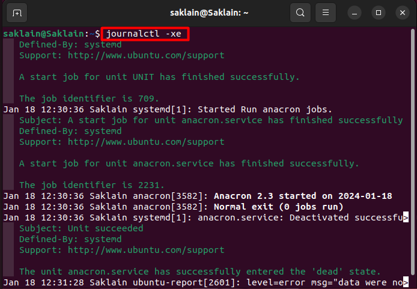
>
> *Networking**
>
> *Basic Networking:**

1.  *Ifconfig (Interface Configuration):**

**ifconfig** is a command line tool used to configure network interfaces
on Unix like operating systems. It allows you to view, configure, and
control network interfaces on your system.

This command displays information about all active network interfaces on
your system including their IP addresses, MAC addresses, and more.

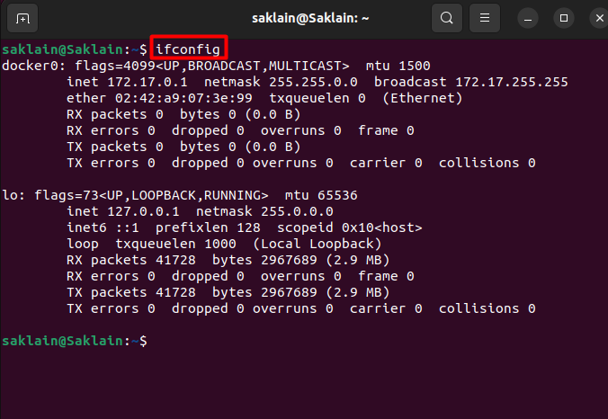

-   View a Specific Interface: **ifconfig ens33**

Replace \"**ens33**\" with the name of your specific network interface
(e.g., eth1, wlan0).

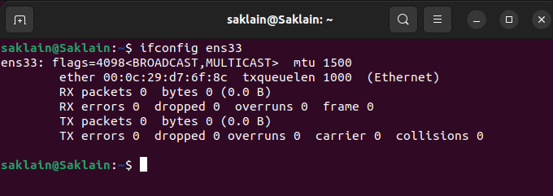

**Enable or Disable an Interface:**

-   sudo ifconfig ens33 up

-   sudo ifconfig etns33 down

This enables (up) or disables (down) the specified network interface.

**Assign an IP Address:**

-   sudo ifconfig ens33 192.168.1.2

This assigns the IP address 192.168.1.2 to the ens33 interface.

**Set Subnet Mask:**

-   sudo ifconfig ens33 192.168.1.2 netmask 255.255.255.0

Specifies the subnet mask for the interface.

2.  *ip Command:**

ip is a more modern and powerful tool for network configuration. It
provides a more consistent and efficient interface compared to ifconfig.

-   **Display Information:** ip addr show

Displays information about all network interfaces along with their IP
addresses.

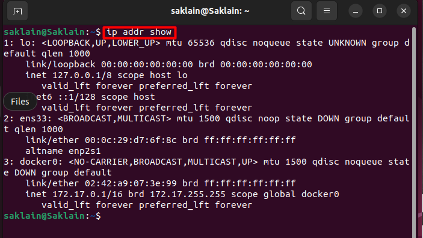

-   **Enable or Disable an Interface:**

```{=html}
<!-- -->
```
-   sudo ip link set ens33 up

-   sudo ip link set ens33 down

```{=html}
<!-- -->
```
-   **Assign an IP Address**: sudo ip addr add 192.168.1.2 dev ens33


-   **Set** **Subnet** **Mask**: sudo ip addr add 192.168.1.2/24 dev
    ens33

Specifies the subnet mask using CIDR notation.

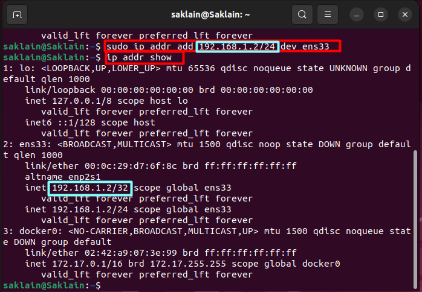

-   **Other ip Commands:**

ip route: Displays and manipulates the IP routing table.

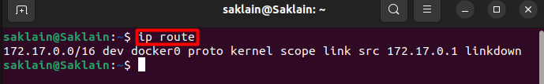

Both ifconfig and ip commands are used for network configuration, but ip
is more modern and recommended for advanced configurations.

Basic networking commands like **ping** and **traceroute** are widely
used for troubleshooting network connectivity issues and analyzing the
path that data takes from one point to another.

-   *ping Command:**

The 'ping' command is used to test the reachability of a host on an
Internet Protocol (IP) network. It sends ICMP Echo Request messages to
the destination host and waits for Echo Reply messages. This is a
fundamental tool for checking if a host is responsive.
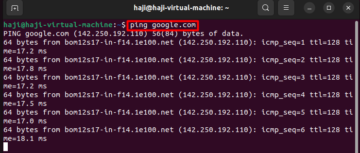

This command will send ICMP Echo Requests to Google\'s servers and
display the round-trip time and other statistics.

-   **Specify Number of Packets:** ping -c 5 google.com


This command sends only 5 ICMP Echo Requests and then stops.

-   **Continuous Ping:** ping -i 2 google.com

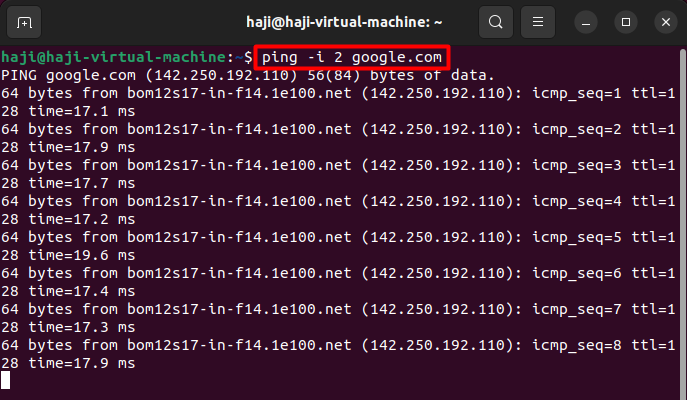

This command sends ICMP Echo Requests every 2 seconds until manually
stopped.

-   **traceroute Command:**

The traceroute command is used to trace the route that packets take to
reach a destination. It provides information about each hop (router)
between the source and destination, along with the time it takes for the
packet to reach each hop.

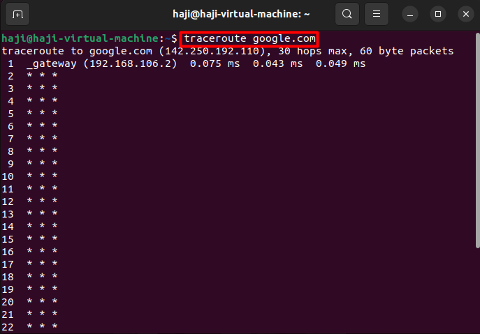

This command shows the route taken by packets from your local machine to
Google\'s servers, including IP addresses and round-trip times.

**Specifying Number of Hops**: traceroute -m 10 google.com

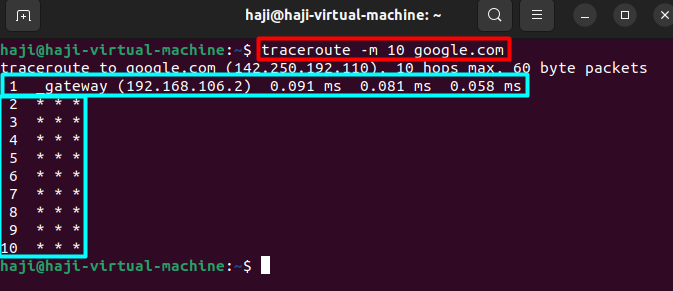

This limits the number of hops to 10.

**Use ICMP Echo Requests:** traceroute -I google.com

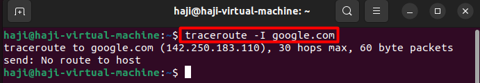

This uses ICMP Echo Requests instead of the default UDP packets.

*Firewall**

*Basic Firewall Configurations:**

Firewalls are essential components of network security that help control
the incoming and outgoing network traffic based on predetermined
security rules. Two commonly used firewall tools in the Linux world are
iptables and ufw (Uncomplicated Firewall).

*iptables:**

iptables is a powerful and flexible firewall tool for Linux. It operates
at the kernel level and allows you to define rules for filtering network
packets.

1.  **Viewing Rules:**

**To view the current firewall rules:** sudo iptables -L

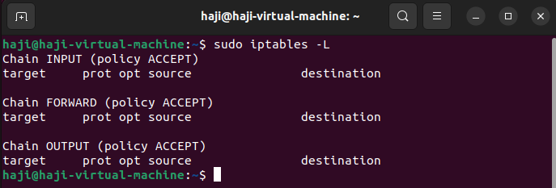

2.  **Allow SSH Access:**

**Allow incoming SSH traffic (port 22):** sudo iptables -A INPUT -p tcp
\--dport 22 -j ACCEPT

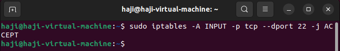

3.  **Allow Established Connections**:

**Allow all established connections:** sudo iptables -A INPUT -m
conntrack \--ctstate ESTABLISHED,RELATED -j ACCEPT

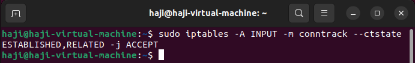

4.  **Deny All Incoming Traffic:**

**Deny all incoming traffic by default**: sudo iptables -A INPUT -j DROP

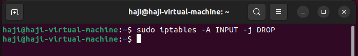

5.  **Save Rules:**

**Save the rules to persist across reboots:**

-   sudo service iptables save

-   sudo service iptables restart

*ufw (Uncomplicated Firewall):**

ufw is a user-friendly interface for managing iptables and is designed
to make firewall configuration easier.

**Install ufw:**

If not installed, install ufw: sudo apt-get install ufw

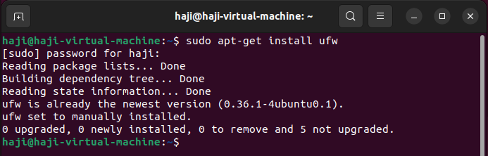

**Enable/Disable ufw:**

Enable ufw: sudo ufw enable

Disable ufw: sudo ufw disable

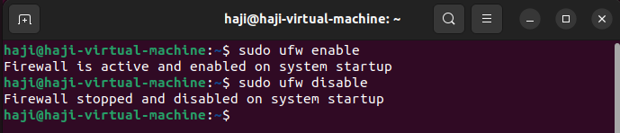

**Allow SSH Access:**

Allow incoming SSH traffic (port 22): sudo ufw allow 22

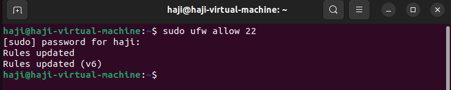

**Allow Specific Port:**

Allow incoming traffic on a specific port (e.g., 80 for HTTP): sudo ufw
allow 80

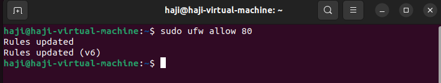

**Deny All Incoming Traffic:**

Deny all incoming traffic by default: sudo ufw default deny incoming

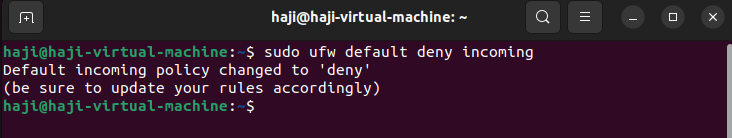

**Allow Outgoing Traffic:**

Allow all outgoing traffic by default: sudo ufw default allow outgoing

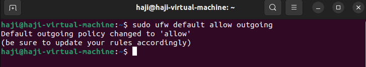

**View Status:**

View the status and rules: sudo ufw status verbose.

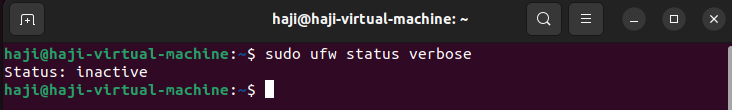


